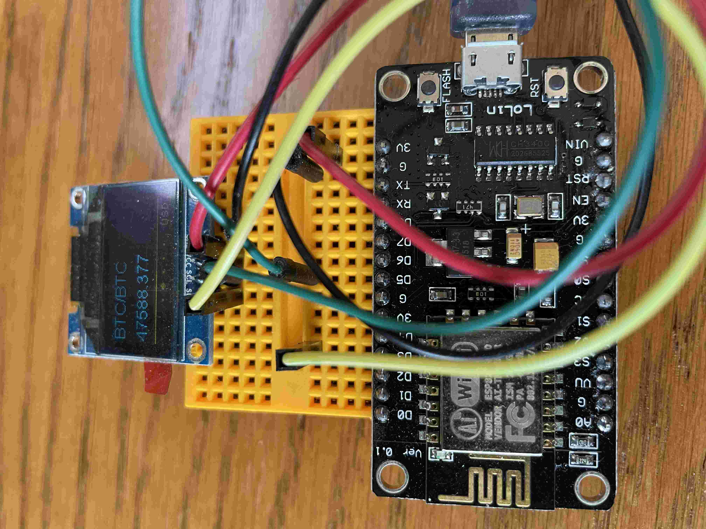
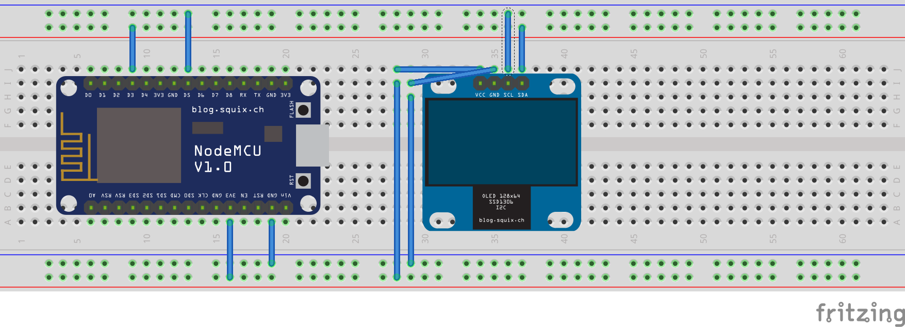

# Cryptoticker

A bagatelle using an [ESP8266](https://en.wikipedia.org/wiki/ESP8266) and a [SSD1306](https://cdn-shop.adafruit.com/datasheets/SSD1306.pdf).

Grabs current prices for several different cryptocurrencies and displays them on the screen. Actually, not quite a ticker...but close.

I had plans for various customization, but made some code changes that resulted in the system crashing on startup. Set it aside for..., well..., 4 years. Oops!

Recently I decided to repo the ESP8266 for a different project, so I've reverted to a working commit, cleaned it up just a bit, and am releasing it. If I had released this back in 2017...I'd still not be a millionaire :P

 

### Possible Enhancements

- Run a webserver on the device that would allow you to connect and

  - customize which currencies to display
  - change prices from USD to GBP, JPY, etc.
 
- change the display to a true ticker and/or add fancier transitions
 
- design and build a _proper_ version based on a production, rather than development board, with a battery and a 3D printed case

### The Circuit

Not much to it really. The 1306 needs to be hooked up to power (3V) and ground&mdash;you can just use any of the appropriate pins on the 8266. Then pick your two favorite GPIO pins, I've chosen D3 and D5, on the 8266 and connect them to the SDA and SDC pins on the 1306.

That's it.

## How to Contribute

Really, you're better off forking this and going your own way. But if you insist: Thank you for taking the time to contribute!

If there's enough interest, I'll pull this back down off the shelf, dust it off, scavange an 8266, and improve the code and functionality.

At the very least, I will work to incorporate any submissions ASAP.

##### Bug Reports and Feature Suggestions

Please submit bug reports and feature suggestions by creating a [new issue](https://github.com/profburke/cryptoticker/issues/new). If possible, look for an existing [open issue](https://github.com/profburke/cryptoticker/issues) that is related and comment on it.

When creating an issue, the more detail, the better. For bug reports in partciular, try to include at least the following information:

* The application version
* The expected behavior
* The observed behavior
* Step-by-step instructions for reproducing the bug

##### Pull Requests

Of course, contributions to the codebase itself are welcome via pull requests.

Please ensure your PR description clearly describes the problem and solution. It should include the relevant issue number, if applicable.

## License

This project is licensed under the BSD 3-Clause License. For details, please read the [LICENSE](https://github.com/profburke/cryptoticker/blob/master/LICENSE) file.
